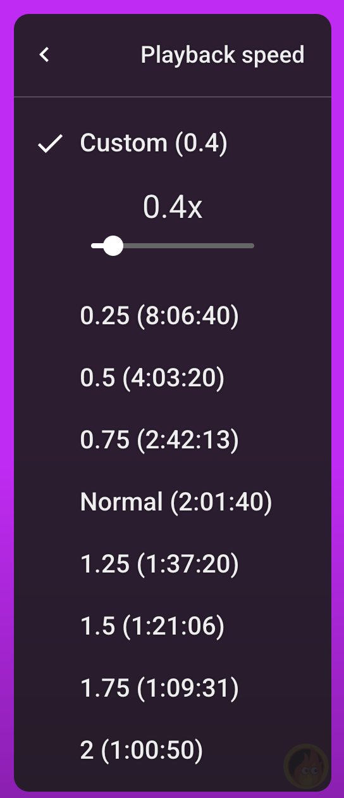

## TimeView

 

Welcome to TimeView! This is a chrome extension designed to allow users to see the new duration of YouTube videos after adjusting speed. The duration of the video is placed next to its corresponding speed as seen here:

